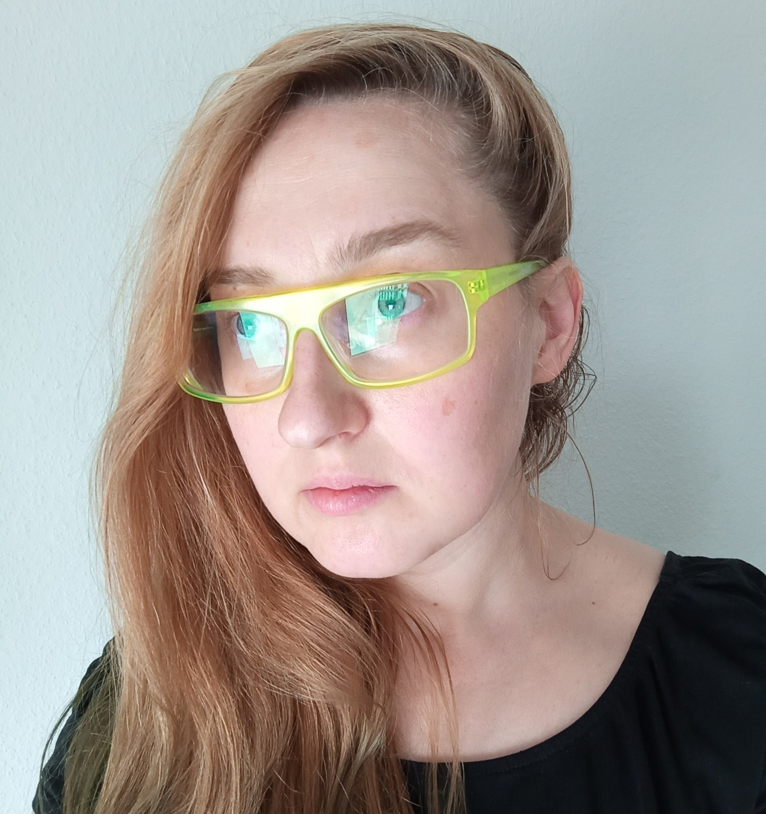

## About me

### Studies

|   |   |   |
| - | - | - |
| 2018-2021 | **ÉSZC Csonka János** | Technical Vocational School, Auto body technicians, Szigetszentmiklós |
| 2016-2018 | **Computer School** | vocational school, Electrician, Budapest |
| 2013-2016 | **Moholy Nagy Art and Design University** | Media Artist, DLA,  Budapest |
| 2012-2015 | **Moholy Nagy Art and Design University** | Visual Art and Design Teacher, MA degree,  Budapest |
| 2011- 2013 | **Moholy Nagy Art and Design University** | Media design, MA degree, Budapest |
| 2011 | **Willem de Kooning Academy** | Audio Visual department, Rotterdam
| 2008-2011 | **Moholy Nagy Art and Design University** | Media design, BA degree, Budapest |

### Scholarships, memberships

|   |   |
| - | - |
| 2019 | Budapest Portfolio review FUTURE  talent, Capa Center |
| 2019 | Budapest Portfolio review MAGNUM workshop scholarship, Capa Center |
| 2017-2019 |	Derkovits Gyula hungarian art scholarship |
| 2013 | Bridge Budapest Fellowship , San Francisco |
| 2013 | Hungarian National grant for scholarship DLA studies |
| 2013 | Rector's award,  best diploma at MOME  |
| 2013 | ESSL ART AWARD CEE, nominee |
| 2012 | Hungarian Republic scholarship |
| 2012 | FKSE Studio of Young Artists’ Foundation, membership |
| 2011 | Erasmus scholarship, Rotterdam |

### Workshops

| | |
|-|-|
| 2020 | Live Coding Camp, Zipernowsky Stúdió, **Budapest** |
| 2019 | MAGNUM PHOTO, CAPA központ, **Budapest** |
|  | KÖZKEMP, **Erdőbénye** |
|  | Chaos Communication Camp, Numberwang village, pancake participant, **Berlin** |
|  | FUTURE TALENT  online tutoring with **PhotoIrland** with Ángel Luis González |

### In public collection

* mama Rose, installation,  2019, **Modem-art collection, Debrecen**
* Concrete-icon, pigmented concrete-print 2017, Museum Kiscell / Municipal Gallery, Budapest

Lorem ipsum dolor sit amet  
fqaeofnewoiwgoijwefopijfew ewfipowfewjef

### Contacts:

* _@mcro.de / m@mcro.de / david.morasz@meso.design
* [Github](https://github.com/microdee)
* [Mastodon](https://mastodon.social/web/accounts/850016)
* [Twitter](https://twitter.com/microdeedev)

### [Get a printer friendly CV](root/cv.pdf)